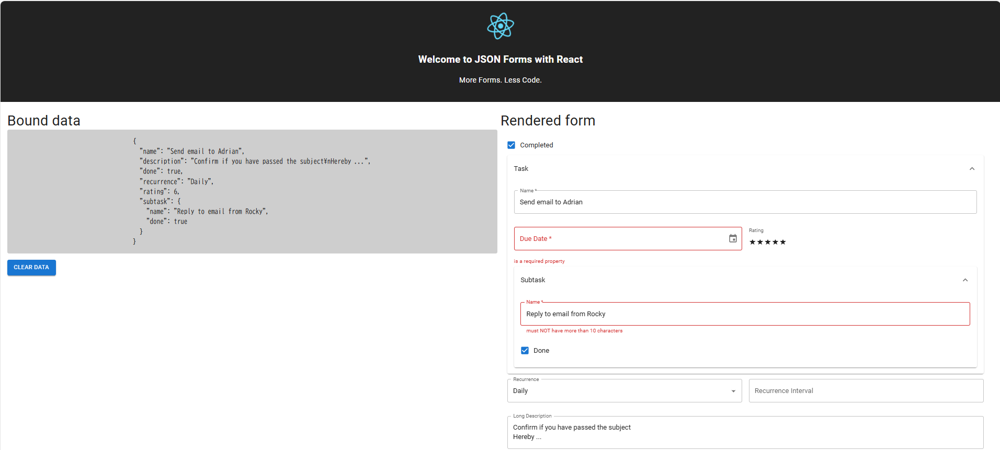

# JSON Forms React seed App

This seed demonstrates how to use [JSON Forms](https://jsonforms.io) with React in order to render a simple form for displaying a task entity.

It is based on `create-react-app` and only contains minor modifications.

- Execute `npm ci` to install the prerequisites. If you want to have the latest released versions use `npm install`.
- Execute `npm run build` to build the application.
- Execute `npm start` to start the application.

Browse to http://localhost:3000 to see the application in action.

## File Structure

Let's briefly have a look at the most important files:

- `src/schema.json` contains the JSON schema (also referred to as 'data schema')
- `src/uischema.json` contains the UI schema
- `src/main.tsx` is the entry point of the application. We also customize the Material UI theme to give each control more space.
- `src/App.tsx` is the main app component and makes use of the `JsonForms` component in order to render a form.

The [data schema](src/schema.json) defines the structure of a Task: it contains attributes such as title, description, due date and so on.

The [corresponding UI schema](src/uischema.json) specifies controls for each property and puts them into a vertical layout that in turn contains two horizontal layouts.

## Rendering JSON Forms

JSON Forms is rendered by importing and using the `JsonForms` component and directly handing over the `schema`, `uischema`, `data`, `renderer` and `cell` props. We listen to changes in the form via the `onChange` callback.

## Custom renderers

Please see [our corresponding tutorial](https://jsonforms.io/docs/tutorial) on how to add custom renderers.

## Screen Shot

